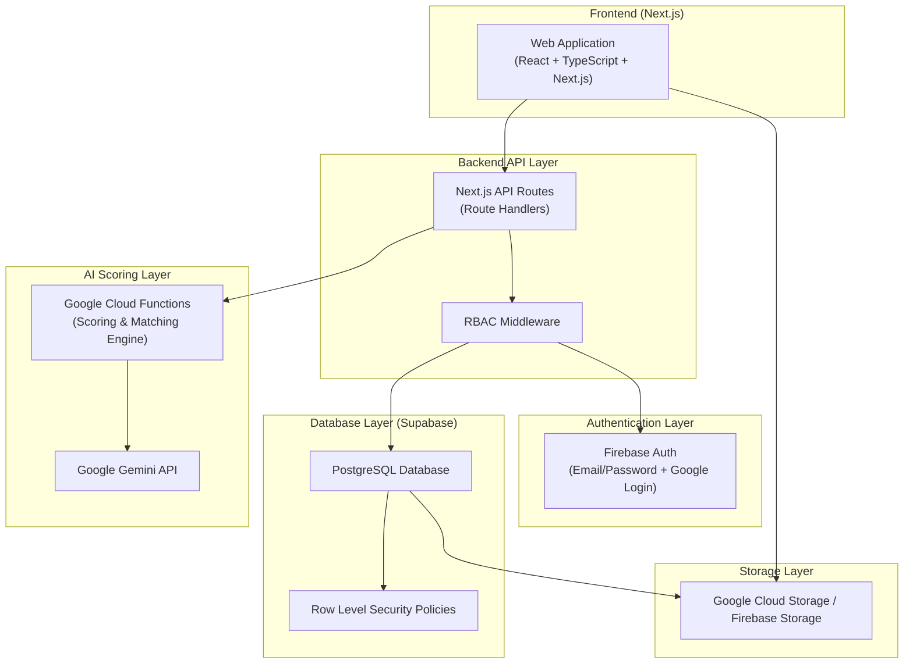

# Energy Capital Match Platform - MVP Design Document

## 1. High-Level Architecture

### System Architecture Diagram



### 1.1 Tech Stack Summary
- **Frontend**: Next.js (React + TypeScript)
- **Backend**: Supabase (PostgreSQL + Row Level Security)
- **Authentication**: Firebase Auth (email/password + Google login)
- **Storage**: Firebase Storage or Google Cloud Storage
- **AI**: Google Gemini API (via Google Cloud Functions)
- **Hosting**: Google Cloud Run or Firebase Hosting

---

## 2. Role-Based Access Control (RBAC)

### 2.1 Roles
- **DEVELOPER**: Projects creators seeking capital/technical partners.
- **CAPITAL_PARTNER**: Investors looking for projects.
- **TECHNICAL_PARTNER**: EPC, O&M, Advisors providing services.
- **GRANT_PROVIDER**: Organizations offering non-dilutive funding.
- **ADMIN**: Platform oversight and user verification.

### 2.2 Implementation
- **Authentication**: Managed via Firebase Auth.
- **Role Storage**: Roles are stored in the Supabase `USERS` table.
- **API Security**: Next.js API routes use middleware to verify Firebase JWTs and check user roles in Supabase.
- **Database Security**: Supabase Row Level Security (RLS) policies enforce data isolation at the table level.

---

## 3. Database Schema (Full SQL)

```sql
-- Enable UUID extension
CREATE EXTENSION IF NOT EXISTS "uuid-ossp";

-- 1. USERS
CREATE TABLE USERS (
    id UUID PRIMARY KEY DEFAULT uuid_generate_v4(),
    email TEXT UNIQUE NOT NULL,
    role TEXT NOT NULL CHECK (role IN ('DEVELOPER', 'CAPITAL_PARTNER', 'TECHNICAL_PARTNER', 'GRANT_PROVIDER', 'ADMIN')),
    company_id UUID, -- References COMPANIES(id)
    verification_status TEXT DEFAULT 'PENDING' CHECK (verification_status IN ('PENDING', 'VERIFIED', 'REJECTED')),
    created_at TIMESTAMPTZ DEFAULT NOW()
);

-- 2. COMPANIES
CREATE TABLE COMPANIES (
    id UUID PRIMARY KEY DEFAULT uuid_generate_v4(),
    name TEXT NOT NULL,
    type TEXT NOT NULL CHECK (type IN ('DEVELOPER', 'CAPITAL', 'TECHNICAL', 'GRANT')),
    country TEXT,
    years_operating INTEGER,
    team_size INTEGER,
    website TEXT,
    created_at TIMESTAMPTZ DEFAULT NOW()
);

-- Add foreign key to USERS (circular reference handled via late binding)
ALTER TABLE USERS ADD CONSTRAINT fk_user_company FOREIGN KEY (company_id) REFERENCES COMPANIES(id) ON DELETE SET NULL;

-- 3. PROJECTS
CREATE TABLE PROJECTS (
    id UUID PRIMARY KEY DEFAULT uuid_generate_v4(),
    developer_id UUID NOT NULL REFERENCES USERS(id) ON DELETE CASCADE,
    name TEXT NOT NULL,
    technology_type TEXT NOT NULL,
    location_country TEXT NOT NULL,
    location_region TEXT,
    project_size_mw DECIMAL(10, 2),
    capital_required_zmw DECIMAL(15, 2),
    capital_structure_type TEXT NOT NULL CHECK (capital_structure_type IN ('EQUITY', 'PROFIT_SHARING', 'LEASING', 'GRANT')),
    governance_terms TEXT,
    exit_terms TEXT,
    risk_disclosures TEXT,
    project_stage TEXT NOT NULL CHECK (project_stage IN ('FEASIBILITY', 'PRE_CONSTRUCTION', 'READY_TO_BUILD', 'UNDER_CONSTRUCTION', 'OPERATIONAL')),
    target_financial_close_date DATE,
    target_cod DATE,
    created_at TIMESTAMPTZ DEFAULT NOW()
);

-- 4. PROJECT_DOCUMENTS
CREATE TABLE PROJECT_DOCUMENTS (
    id UUID PRIMARY KEY DEFAULT uuid_generate_v4(),
    project_id UUID NOT NULL REFERENCES PROJECTS(id) ON DELETE CASCADE,
    document_type TEXT NOT NULL,
    file_url TEXT NOT NULL,
    uploaded_at TIMESTAMPTZ DEFAULT NOW()
);

-- 5. CAPITAL_PARTNERS
CREATE TABLE CAPITAL_PARTNERS (
    id UUID PRIMARY KEY DEFAULT uuid_generate_v4(),
    company_id UUID NOT NULL REFERENCES COMPANIES(id) ON DELETE CASCADE,
    preferred_structures TEXT[] NOT NULL, -- Array of ENUM values: EQUITY, PROFIT_SHARING, LEASING, GRANT
    min_ticket_size DECIMAL(15, 2),
    max_ticket_size DECIMAL(15, 2),
    risk_tolerance TEXT CHECK (risk_tolerance IN ('LOW', 'MEDIUM', 'HIGH')),
    governance_preference TEXT CHECK (governance_preference IN ('PASSIVE', 'BOARD_SEAT', 'ACTIVE_ROLE')),
    geographic_focus TEXT[],
    sector_focus TEXT[]
);

-- 6. TECHNICAL_PARTNERS
CREATE TABLE TECHNICAL_PARTNERS (
    id UUID PRIMARY KEY DEFAULT uuid_generate_v4(),
    company_id UUID NOT NULL REFERENCES COMPANIES(id) ON DELETE CASCADE,
    service_categories TEXT[],
    sector_experience TEXT[],
    min_mw_capacity DECIMAL(10, 2),
    max_mw_capacity DECIMAL(10, 2),
    regions_operated TEXT[],
    annual_delivery_capacity_mw DECIMAL(10, 2),
    total_mw_delivered DECIMAL(10, 2),
    largest_project_mw DECIMAL(10, 2),
    average_delivery_time_months INTEGER,
    bonding_capacity DECIMAL(15, 2),
    delivery_models TEXT[] -- Array of ENUM: FIXED_PRICE, COST_PLUS, MILESTONE, ADVISORY_ONLY
);

-- 7. PROJECT_TECH_REQUIREMENTS
CREATE TABLE PROJECT_TECH_REQUIREMENTS (
    id UUID PRIMARY KEY DEFAULT uuid_generate_v4(),
    project_id UUID NOT NULL REFERENCES PROJECTS(id) ON DELETE CASCADE,
    required_services TEXT[],
    terrain_complexity TEXT,
    grid_status TEXT,
    budget_preference TEXT CHECK (budget_preference IN ('FIXED', 'MILESTONE', 'NEGOTIABLE'))
);

-- 8. PROJECT_SCORES
CREATE TABLE PROJECT_SCORES (
    id UUID PRIMARY KEY DEFAULT uuid_generate_v4(),
    project_id UUID NOT NULL REFERENCES PROJECTS(id) ON DELETE CASCADE,
    capital_readiness_score INTEGER CHECK (capital_readiness_score BETWEEN 0 AND 100),
    technical_readiness_score INTEGER CHECK (technical_readiness_score BETWEEN 0 AND 100),
    documentation_score INTEGER,
    governance_score INTEGER,
    financial_transparency_score INTEGER,
    risk_flags JSONB DEFAULT '[]',
    recommendations JSONB DEFAULT '[]',
    created_at TIMESTAMPTZ DEFAULT NOW()
);

-- 9. CAPITAL_MATCH_RESULTS
CREATE TABLE CAPITAL_MATCH_RESULTS (
    id UUID PRIMARY KEY DEFAULT uuid_generate_v4(),
    project_id UUID NOT NULL REFERENCES PROJECTS(id) ON DELETE CASCADE,
    capital_partner_id UUID NOT NULL REFERENCES CAPITAL_PARTNERS(id) ON DELETE CASCADE,
    compatibility_score INTEGER CHECK (compatibility_score BETWEEN 0 AND 100),
    score_breakdown JSONB,
    created_at TIMESTAMPTZ DEFAULT NOW()
);

-- 10. TECHNICAL_MATCH_RESULTS
CREATE TABLE TECHNICAL_MATCH_RESULTS (
    id UUID PRIMARY KEY DEFAULT uuid_generate_v4(),
    project_id UUID NOT NULL REFERENCES PROJECTS(id) ON DELETE CASCADE,
    technical_partner_id UUID NOT NULL REFERENCES TECHNICAL_PARTNERS(id) ON DELETE CASCADE,
    compatibility_score INTEGER CHECK (compatibility_score BETWEEN 0 AND 100),
    score_breakdown JSONB,
    created_at TIMESTAMPTZ DEFAULT NOW()
);

-- 11. ENGAGEMENTS
CREATE TABLE ENGAGEMENTS (
    id UUID PRIMARY KEY DEFAULT uuid_generate_v4(),
    project_id UUID NOT NULL REFERENCES PROJECTS(id) ON DELETE CASCADE,
    counterparty_id UUID NOT NULL, -- References CAPITAL_PARTNERS(id) or TECHNICAL_PARTNERS(id)
    counterparty_type TEXT NOT NULL CHECK (counterparty_type IN ('CAPITAL', 'TECHNICAL')),
    status TEXT NOT NULL CHECK (status IN ('INTRO_SENT', 'INTRO_ACCEPTED', 'DUE_DILIGENCE', 'TERM_SHEET', 'CONTRACT_SIGNED', 'CAPITAL_COMMITTED', 'CLOSED', 'DROPPED')),
    created_at TIMESTAMPTZ DEFAULT NOW(),
    updated_at TIMESTAMPTZ DEFAULT NOW()
);

-- 12. MESSAGES
CREATE TABLE MESSAGES (
    id UUID PRIMARY KEY DEFAULT uuid_generate_v4(),
    engagement_id UUID NOT NULL REFERENCES ENGAGEMENTS(id) ON DELETE CASCADE,
    sender_id UUID NOT NULL REFERENCES USERS(id),
    message_body TEXT NOT NULL,
    created_at TIMESTAMPTZ DEFAULT NOW()
);

-- 13. AUDIT_LOGS
CREATE TABLE AUDIT_LOGS (
    id UUID PRIMARY KEY DEFAULT uuid_generate_v4(),
    user_id UUID REFERENCES USERS(id),
    action_type TEXT NOT NULL,
    entity_type TEXT NOT NULL,
    entity_id UUID NOT NULL,
    timestamp TIMESTAMPTZ DEFAULT NOW()
);

-- Indexes
CREATE INDEX idx_users_email ON USERS(email);
CREATE INDEX idx_projects_developer ON PROJECTS(developer_id);
CREATE INDEX idx_engagements_project ON ENGAGEMENTS(project_id);
CREATE INDEX idx_match_capital_project ON CAPITAL_MATCH_RESULTS(project_id);
CREATE INDEX idx_match_technical_project ON TECHNICAL_MATCH_RESULTS(project_id);
```

---

## 4. Scoring Engine Design

The system uses a hybrid scoring engine combining deterministic rules and AI-driven narrative analysis via the Gemini API.

### 4.1 Capital Readiness Score (0-100)
**Weight Distribution:**
- Documentation Completeness: 20%
- Governance Clarity: 20%
- Financial Transparency: 20%
- Risk Disclosure Quality: 15%
- Developer Track Record: 15%
- AI Risk Analysis (Gemini): 10%

**AI Component:**
Google Cloud Functions trigger the Gemini API to analyze `PROJECT_DOCUMENTS`. The AI returns a structured JSON assessing risk signals, missing docs, and clarity.

### 4.2 Technical Readiness Score (0-100)
Calculated based on:
- Engineering completeness
- Grid connection clarity
- Environmental approvals
- Construction timeline realism
- Technical documentation quality

---

## 5. Matching Algorithms

### 5.1 Capital Matching Score (0-100)
**Weights:**
- Capital Range Overlap: 30%
- Structure Compatibility: 20%
- Risk Tolerance Alignment: 15%
- Governance Preference Alignment: 15%
- Sector Match: 10%
- Geographic Match: 10%

**Pseudocode:**
```typescript
function calculateCapitalMatch(project, partner) {
  let score = 0;
  
  // 1. Capital Range Overlap (30%)
  if (project.capital_required_zmw >= partner.min_ticket_size &&
      project.capital_required_zmw <= partner.max_ticket_size) {
    score += 30;
  }
  
  // 2. Structure Compatibility (20%)
  if (partner.preferred_structures.includes(project.capital_structure_type)) {
    score += 20;
  }
  
  // 3. Risk Tolerance Alignment (15%)
  // Logic: Map project_stage to Risk (FEASIBILITY=HIGH, OPERATIONAL=LOW)
  if (mapStageToRisk(project.stage) === partner.risk_tolerance) {
    score += 15;
  }
  
  // 4. Governance Preference Alignment (15%)
  if (project.governance_preference === partner.governance_preference) {
    score += 15;
  }
  
  // 5. Sector/Geographic (10% each)
  if (partner.sector_focus.includes(project.technology_type)) score += 10;
  if (partner.geographic_focus.includes(project.location_country)) score += 10;
  
  return score;
}
```

### 5.2 Technical Matching Score (0-100)
**Weights:**
- Service Category Match: 25%
- Sector Experience Match: 20%
- MW Size Compatibility: 20%
- Geographic Coverage: 15%
- Timeline Availability: 10%
- Track Record Strength: 10%

---

## 6. Engagement Workflow State Machine

Transitions are controlled via backend API logic to ensure valid state progression.

**States:**
`INTRO_SENT` → `INTRO_ACCEPTED` → `DUE_DILIGENCE` → `TERM_SHEET` → `CONTRACT_SIGNED` → `CAPITAL_COMMITTED` → `CLOSED`

**Rule:** `DROPPED` can be triggered from any state.

---

## 7. System Constraints

The platform explicitly prohibits debt-based financial modeling to remain a structured capital and project intelligence tool.

**Prohibited Fields & Calculations:**
- Interest rate fields
- Loan repayment schedules
- Fixed return inputs
- Debt instruments
- APR calculations

**Allowed Capital Structures:**
- EQUITY
- PROFIT_SHARING
- LEASING
- GRANT

**Enforcement:**
- **Schema Level**: `CHECK` constraints on table columns.
- **API Level**: Payload validation in Next.js Route Handlers.
- **Frontend Level**: Strict input types and form validation.

---

## 8. Security Requirements

- **Supabase Row Level Security (RLS)**: Policies ensure users only access data related to their organization or matched engagements.
- **Signed URLs**: All documents in GCS are private; the frontend requests short-lived signed URLs for viewing.
- **Role-Based API Guards**: Higher-order functions in Next.js protect routes.
- **Audit Trails**: Every write action is logged to `AUDIT_LOGS`.
- **Input Sanitization**: Prevents XSS and injection.
- **Rate Limiting**: Applied to match/score request endpoints to prevent resource exhaustion.

---

## 9. Folder Structure (Next.js)

```text
/src
  /app
    /api
      /auth        # Firebase verification
      /projects    # Project CRUD
      /scoring     # Trigger scoring
      /matching    # Fetch matches
      /engagements # Workflow management
    /dashboard
      /developer
      /investor
      /technical
      /admin
  /components      # UI components (Radix/Tailwind)
  /hooks           # React Query/Auth hooks
  /lib
    /supabase      # Client & RLS config
    /firebase      # Auth initialization
  /services        # Business logic & external APIs
  /types           # TypeScript interfaces
```

---

## 10. Cloud Function Structure (AI Scoring)

```text
/functions
  /src
    index.ts       # Entry point
    scoring.ts     # Gemini API integration & Rule engine
    matching.ts    # Background matching calculations
    utils.ts       # Supabase client & error handling
  package.json
  tsconfig.json
```

---

## 11. Example JSON Response (Scoring + Matching)

### Project Score JSON
```json
{
  "project_id": "uuid-123",
  "total_score": 82,
  "breakdown": {
    "documentation": 85,
    "governance": 75,
    "financial_transparency": 90,
    "risk_disclosure": 80,
    "developer_track_record": 80,
    "ai_analysis": 85
  },
  "risk_flags": ["Missing Grid Agreement (Draft Only)"],
  "recommendations": ["Upload final PPA", "Clarify board seat allocation"]
}
```

### Match Result JSON
```json
{
  "project_id": "uuid-123",
  "top_matches": [
    {
      "partner_id": "uuid-partner-1",
      "compatibility_score": 95,
      "breakdown": {
        "range_overlap": 100,
        "structure": 100,
        "risk_alignment": 90
      }
    }
  ]
}
```

---

## 12. Future Extensibility
- **Carbon Finance Integration**: Adding carbon credit eligibility scoring.
- **Regional Expansion**: Multi-currency support (though constrained by debt rules).
- **Advanced Analytics**: Portfolio-level risk modeling for admins.
