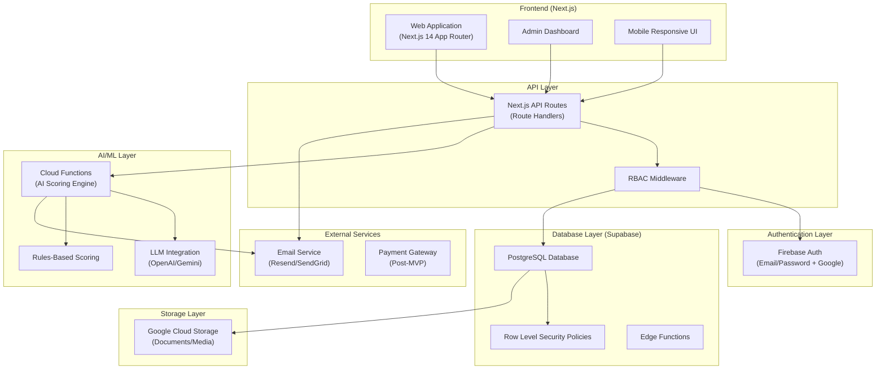
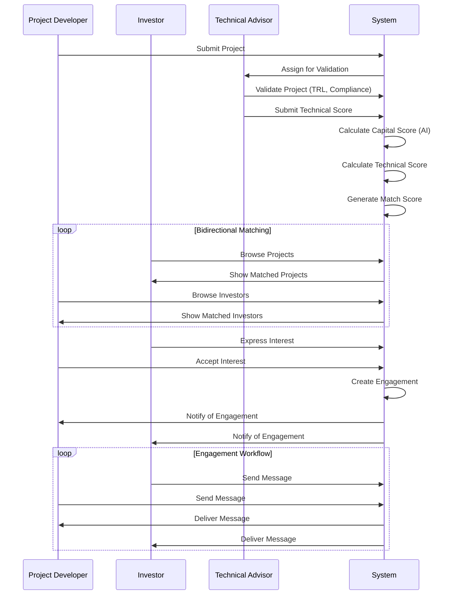
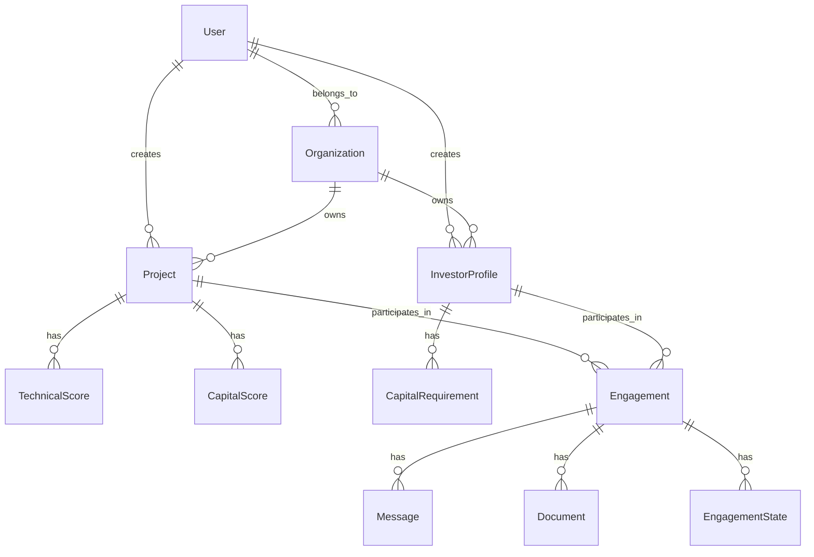
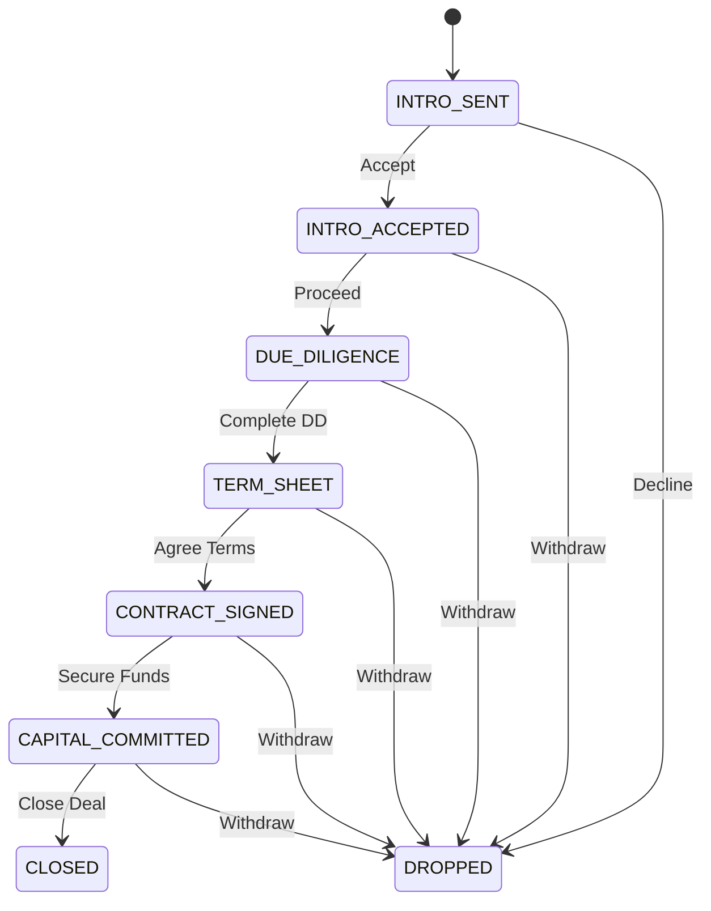

# Energy Capital Match Platform - MVP Design Document

## 1. High-Level Architecture

### System Architecture Diagram



### User Flow Diagram



---

## 2. Database Schema

### Entity-Relationship Diagram



### SQL Schema

```sql
-- Enable UUID extension
CREATE EXTENSION IF NOT EXISTS "uuid-ossp";

-- Organizations (Companies)
CREATE TABLE organizations (
    id UUID PRIMARY KEY DEFAULT uuid_generate_v4(),
    name TEXT NOT NULL,
    type TEXT NOT NULL CHECK (type IN ('DEVELOPER', 'CAPITAL', 'TECHNICAL', 'GRANT')),
    website TEXT,
    description TEXT,
    logo_url TEXT,
    country TEXT,
    years_operating INTEGER,
    team_size INTEGER,
    created_at TIMESTAMPTZ DEFAULT NOW(),
    updated_at TIMESTAMPTZ DEFAULT NOW()
);

-- Users
CREATE TABLE users (
    id UUID PRIMARY KEY DEFAULT uuid_generate_v4(),
    email TEXT UNIQUE NOT NULL,
    full_name TEXT,
    role TEXT NOT NULL CHECK (role IN ('DEVELOPER', 'CAPITAL_PARTNER', 'TECHNICAL_PARTNER', 'GRANT_PROVIDER', 'ADMIN')),
    organization_id UUID REFERENCES organizations(id) ON DELETE SET NULL,
    avatar_url TEXT,
    email_verified BOOLEAN DEFAULT FALSE,
    verification_status TEXT DEFAULT 'PENDING' CHECK (verification_status IN ('PENDING', 'VERIFIED', 'REJECTED')),
    created_at TIMESTAMPTZ DEFAULT NOW(),
    updated_at TIMESTAMPTZ DEFAULT NOW()
);

-- Project Categories
CREATE TABLE project_categories (
    id UUID PRIMARY KEY DEFAULT uuid_generate_v4(),
    name TEXT NOT NULL UNIQUE,
    description TEXT,
    icon TEXT
);

-- Projects
CREATE TABLE projects (
    id UUID PRIMARY KEY DEFAULT uuid_generate_v4(),
    organization_id UUID NOT NULL REFERENCES organizations(id) ON DELETE CASCADE,
    name TEXT NOT NULL,
    category_id UUID REFERENCES project_categories(id),
    description TEXT,
    technology_type TEXT,
    location_country TEXT,
    location_region TEXT,
    location_city TEXT,
    capacity_mw DECIMAL(10, 2),
    capital_requirement_usd BIGINT,
    capital_structure_type TEXT NOT NULL CHECK (capital_structure_type IN ('EQUITY', 'PROFIT_SHARING', 'LEASING', 'GRANT')),
    governance_terms TEXT,
    exit_terms TEXT,
    risk_disclosures TEXT,
    project_stage TEXT NOT NULL CHECK (project_stage IN ('FEASIBILITY', 'PRE_CONSTRUCTION', 'READY_TO_BUILD', 'UNDER_CONSTRUCTION', 'OPERATIONAL')),
    target_financial_close_date DATE,
    target_cod DATE,
    status TEXT DEFAULT 'draft' CHECK (status IN ('draft', 'submitted', 'under_review', 'validated', 'rejected', 'funded')),
    created_at TIMESTAMPTZ DEFAULT NOW(),
    updated_at TIMESTAMPTZ DEFAULT NOW()
);

-- Project Documents
CREATE TABLE project_documents (
    id UUID PRIMARY KEY DEFAULT uuid_generate_v4(),
    project_id UUID NOT NULL REFERENCES projects(id) ON DELETE CASCADE,
    document_type TEXT NOT NULL CHECK (document_type IN ('PITCH_DECK', 'FINANCIAL_MODEL', 'TECHNICAL_REPORT', 'LEGAL_DOCUMENT', 'ENVIRONMENTAL_PERMIT', 'GRID_AGREEMENT', 'LAND_RIGHT', 'OTHER')),
    file_url TEXT NOT NULL,
    file_name TEXT NOT NULL,
    file_size_bytes INTEGER,
    mime_type TEXT,
    uploaded_by UUID REFERENCES users(id),
    uploaded_at TIMESTAMPTZ DEFAULT NOW()
);

-- Project Scores (Combined Scoring)
CREATE TABLE project_scores (
    id UUID PRIMARY KEY DEFAULT uuid_generate_v4(),
    project_id UUID NOT NULL REFERENCES projects(id) ON DELETE CASCADE,
    capital_readiness_score INTEGER CHECK (capital_readiness_score >= 0 AND capital_readiness_score <= 100),
    technical_readiness_score INTEGER CHECK (technical_readiness_score >= 0 AND technical_readiness_score <= 100),
    documentation_score INTEGER CHECK (documentation_score >= 0 AND documentation_score <= 100),
    governance_score INTEGER CHECK (governance_score >= 0 AND governance_score <= 100),
    financial_transparency_score INTEGER CHECK (financial_transparency_score >= 0 AND financial_transparency_score <= 100),
    risk_flags JSONB DEFAULT '[]'::jsonb,
    recommendations JSONB DEFAULT '[]'::jsonb,
    scoring_model_version TEXT,
    ai_analysis_summary TEXT,
    scored_at TIMESTAMPTZ,
    created_at TIMESTAMPTZ DEFAULT NOW()
);

-- Capital Match Results
CREATE TABLE capital_match_results (
    id UUID PRIMARY KEY DEFAULT uuid_generate_v4(),
    project_id UUID NOT NULL REFERENCES projects(id) ON DELETE CASCADE,
    capital_partner_id UUID NOT NULL REFERENCES capital_partners(id) ON DELETE CASCADE,
    compatibility_score INTEGER CHECK (compatibility_score >= 0 AND compatibility_score <= 100),
    score_breakdown JSONB DEFAULT '{}'::jsonb,
    created_at TIMESTAMPTZ DEFAULT NOW(),
    UNIQUE(project_id, capital_partner_id)
);

-- Technical Match Results
CREATE TABLE technical_match_results (
    id UUID PRIMARY KEY DEFAULT uuid_generate_v4(),
    project_id UUID NOT NULL REFERENCES projects(id) ON DELETE CASCADE,
    technical_partner_id UUID NOT NULL REFERENCES technical_partners(id) ON DELETE CASCADE,
    compatibility_score INTEGER CHECK (compatibility_score >= 0 AND compatibility_score <= 100),
    score_breakdown JSONB DEFAULT '{}'::jsonb,
    created_at TIMESTAMPTZ DEFAULT NOW(),
    UNIQUE(project_id, technical_partner_id)
);

-- Capital Partners (formerly Investor Profiles)
CREATE TABLE capital_partners (
    id UUID PRIMARY KEY DEFAULT uuid_generate_v4(),
    organization_id UUID NOT NULL REFERENCES organizations(id) ON DELETE CASCADE,
    name TEXT NOT NULL,
    description TEXT,
    preferred_structures TEXT[] CHECK (array_length(preferred_structures, 1) > 0 AND preferred_structures <@ ARRAY['EQUITY', 'PROFIT_SHARING', 'LEASING', 'GRANT']::text[]),
    min_ticket_size BIGINT,
    max_ticket_size BIGINT,
    risk_tolerance TEXT CHECK (risk_tolerance IN ('LOW', 'MEDIUM', 'HIGH')),
    governance_preference TEXT CHECK (governance_preference IN ('PASSIVE', 'BOARD_SEAT', 'ACTIVE_ROLE')),
    geographic_focus TEXT[],
    sector_focus TEXT[],
    status TEXT DEFAULT 'active' CHECK (status IN ('active', 'inactive', 'paused')),
    created_at TIMESTAMPTZ DEFAULT NOW(),
    updated_at TIMESTAMPTZ DEFAULT NOW()
);

-- Technical Partners
CREATE TABLE technical_partners (
    id UUID PRIMARY KEY DEFAULT uuid_generate_v4(),
    organization_id UUID NOT NULL REFERENCES organizations(id) ON DELETE CASCADE,
    name TEXT NOT NULL,
    description TEXT,
    service_categories TEXT[] CHECK (array_length(service_categories, 1) > 0),
    sector_experience TEXT[],
    min_mw_capacity DECIMAL(10, 2),
    max_mw_capacity DECIMAL(10, 2),
    regions_operated TEXT[],
    annual_delivery_capacity_mw DECIMAL(10, 2),
    total_mw_delivered DECIMAL(10, 2),
    largest_project_mw DECIMAL(10, 2),
    average_delivery_time_months INTEGER,
    bonding_capacity DECIMAL(15, 2),
    delivery_models TEXT[] CHECK (array_length(delivery_models, 1) > 0),
    status TEXT DEFAULT 'active' CHECK (status IN ('active', 'inactive', 'paused')),
    created_at TIMESTAMPTZ DEFAULT NOW(),
    updated_at TIMESTAMPTZ DEFAULT NOW()
);

-- Project Technical Requirements
CREATE TABLE project_tech_requirements (
    id UUID PRIMARY KEY DEFAULT uuid_generate_v4(),
    project_id UUID NOT NULL REFERENCES projects(id) ON DELETE CASCADE,
    required_services TEXT[] CHECK (array_length(required_services, 1) > 0),
    terrain_complexity TEXT CHECK (terrain_complexity IN ('FLAT', 'MODERATE', 'MOUNTAINOUS', 'DESERT', 'OFFSHORE')),
    grid_status TEXT CHECK (grid_status IN ('CONNECTED', 'STANDALONE', 'HYBRID')),
    budget_preference TEXT CHECK (budget_preference IN ('FIXED', 'MILESTONE', 'NEGOTIABLE')),
    created_at TIMESTAMPTZ DEFAULT NOW(),
    updated_at TIMESTAMPTZ DEFAULT NOW()
);

-- Engagements (Matches in progress)
CREATE TABLE engagements (
    id UUID PRIMARY KEY DEFAULT uuid_generate_v4(),
    project_id UUID NOT NULL REFERENCES projects(id) ON DELETE CASCADE,
    counterparty_id UUID NOT NULL,
    counterparty_type TEXT NOT NULL CHECK (counterparty_type IN ('CAPITAL', 'TECHNICAL')),
    initiator_id UUID REFERENCES users(id),
    state TEXT DEFAULT 'INTRO_SENT' CHECK (state IN ('INTRO_SENT', 'INTRO_ACCEPTED', 'DUE_DILIGENCE', 'TERM_SHEET', 'CONTRACT_SIGNED', 'CAPITAL_COMMITTED', 'CLOSED', 'DROPPED')),
    created_at TIMESTAMPTZ DEFAULT NOW(),
    updated_at TIMESTAMPTZ DEFAULT NOW()
);

-- Engagement State History
CREATE TABLE engagement_states (
    id UUID PRIMARY KEY DEFAULT uuid_generate_v4(),
    engagement_id UUID NOT NULL REFERENCES engagements(id) ON DELETE CASCADE,
    from_state TEXT,
    to_state TEXT NOT NULL,
    changed_by_user_id UUID REFERENCES users(id),
    notes TEXT,
    changed_at TIMESTAMPTZ DEFAULT NOW()
);

-- Messages
CREATE TABLE messages (
    id UUID PRIMARY KEY DEFAULT uuid_generate_v4(),
    engagement_id UUID NOT NULL REFERENCES engagements(id) ON DELETE CASCADE,
    sender_id UUID NOT NULL REFERENCES users(id),
    message_body TEXT NOT NULL,
    is_read BOOLEAN DEFAULT FALSE,
    created_at TIMESTAMPTZ DEFAULT NOW()
);

-- Audit Logs
CREATE TABLE audit_logs (
    id UUID PRIMARY KEY DEFAULT uuid_generate_v4(),
    user_id UUID REFERENCES users(id),
    action_type TEXT NOT NULL,
    entity_type TEXT NOT NULL,
    entity_id UUID NOT NULL,
    metadata JSONB DEFAULT '{}'::jsonb,
    timestamp TIMESTAMPTZ DEFAULT NOW()
);

-- Documents
CREATE TABLE documents (
    id UUID PRIMARY KEY DEFAULT uuid_generate_v4(),
    engagement_id UUID NOT NULL REFERENCES engagements(id) ON DELETE CASCADE,
    uploader_id UUID NOT NULL REFERENCES users(id),
    name TEXT NOT NULL,
    type TEXT NOT NULL CHECK (type IN ('nda', 'pitch_deck', 'financial_model', 'term_sheet', 'legal_document', 'due_diligence', 'other')),
    file_url TEXT NOT NULL,
    file_size_bytes INTEGER,
    mime_type TEXT,
    created_at TIMESTAMPTZ DEFAULT NOW()
);

-- Interest Expressions
CREATE TABLE interest_expressions (
    id UUID PRIMARY KEY DEFAULT uuid_generate_v4(),
    project_id UUID NOT NULL REFERENCES projects(id) ON DELETE CASCADE,
    investor_profile_id UUID NOT NULL REFERENCES investor_profiles(id) ON DELETE CASCADE,
    expressed_by_user_id UUID REFERENCES users(id),
    message TEXT,
    status TEXT DEFAULT 'pending' CHECK (status IN ('pending', 'accepted', 'declined', 'withdrawn')),
    created_at TIMESTAMPTZ DEFAULT NOW(),
    updated_at TIMESTAMPTZ DEFAULT NOW(),
    UNIQUE(project_id, investor_profile_id)
);

-- Indexes for Performance
CREATE INDEX idx_projects_organization ON projects(organization_id);
CREATE INDEX idx_projects_category ON projects(category_id);
CREATE INDEX idx_projects_status ON projects(status);
CREATE INDEX idx_projects_capital_requirement ON projects(capital_requirement_usd);
CREATE INDEX idx_projects_stage ON projects(project_stage);
CREATE INDEX idx_project_documents_project ON project_documents(project_id);
CREATE INDEX idx_project_scores_project ON project_scores(project_id);
CREATE INDEX idx_capital_match_results_project ON capital_match_results(project_id);
CREATE INDEX idx_capital_match_results_capital ON capital_match_results(capital_partner_id);
CREATE INDEX idx_technical_match_results_project ON technical_match_results(project_id);
CREATE INDEX idx_technical_match_results_technical ON technical_match_results(technical_partner_id);
CREATE INDEX idx_technical_partners_organization ON technical_partners(organization_id);
CREATE INDEX idx_capital_partners_organization ON capital_partners(organization_id);
CREATE INDEX idx_engagements_project ON engagements(project_id);
CREATE INDEX idx_engagements_counterparty ON engagements(counterparty_id, counterparty_type);
CREATE INDEX idx_messages_engagement ON messages(engagement_id);
CREATE INDEX idx_audit_logs_user ON audit_logs(user_id);
CREATE INDEX idx_audit_logs_entity ON audit_logs(entity_type, entity_id);
```

### Row Level Security (RLS) Policies

```sql
-- Enable RLS on all tables
ALTER TABLE organizations ENABLE ROW LEVEL SECURITY;
ALTER TABLE users ENABLE ROW LEVEL SECURITY;
ALTER TABLE project_categories ENABLE ROW LEVEL SECURITY;
ALTER TABLE projects ENABLE ROW LEVEL SECURITY;
ALTER TABLE project_documents ENABLE ROW LEVEL SECURITY;
ALTER TABLE project_scores ENABLE ROW LEVEL SECURITY;
ALTER TABLE capital_match_results ENABLE ROW LEVEL SECURITY;
ALTER TABLE technical_match_results ENABLE ROW LEVEL SECURITY;
ALTER TABLE capital_partners ENABLE ROW LEVEL SECURITY;
ALTER TABLE technical_partners ENABLE ROW LEVEL SECURITY;
ALTER TABLE project_tech_requirements ENABLE ROW LEVEL SECURITY;
ALTER TABLE engagements ENABLE ROW LEVEL SECURITY;
ALTER TABLE engagement_states ENABLE ROW LEVEL SECURITY;
ALTER TABLE messages ENABLE ROW LEVEL SECURITY;
ALTER TABLE audit_logs ENABLE ROW LEVEL SECURITY;
ALTER TABLE documents ENABLE ROW LEVEL SECURITY;

-- Organizations: Public read, Org member write
CREATE POLICY "orgs_public_read" ON organizations FOR SELECT USING (true);
CREATE POLICY "orgs_member_insert" ON organizations FOR INSERT WITH CHECK (auth.uid() IN (SELECT id FROM users WHERE organization_id = auth.uid()));
CREATE POLICY "orgs_member_update" ON organizations FOR UPDATE USING (auth.uid() IN (SELECT id FROM users WHERE organization_id = id));

-- Users: Read own profile, Admin read all
CREATE POLICY "users_read_own" ON users FOR SELECT USING (auth.uid() = id);
CREATE POLICY "users_update_own" ON users FOR UPDATE USING (auth.uid() = id);
CREATE POLICY "users_admin_read" ON users FOR SELECT USING (
    EXISTS (SELECT 1 FROM users WHERE id = auth.uid() AND role = 'ADMIN')
);

-- Projects: Read published, Developer read own, Admin read all
CREATE POLICY "projects_public_read" ON projects FOR SELECT USING (
    status IN ('validated', 'funded') OR
    organization_id IN (SELECT organization_id FROM users WHERE id = auth.uid())
);
CREATE POLICY "projects_developer_insert" ON projects FOR INSERT WITH CHECK (
    EXISTS (SELECT 1 FROM users WHERE id = auth.uid() AND role = 'DEVELOPER' AND organization_id = organization_id)
);
CREATE POLICY "projects_developer_update" ON projects FOR UPDATE USING (
    EXISTS (SELECT 1 FROM users WHERE id = auth.uid() AND role = 'DEVELOPER' AND organization_id = organization_id)
);
CREATE POLICY "projects_admin_full" ON projects FOR ALL USING (
    EXISTS (SELECT 1 FROM users WHERE id = auth.uid() AND role = 'ADMIN')
);

-- Project Scores: Read validated projects
CREATE POLICY "scores_read" ON project_scores FOR SELECT USING (
    EXISTS (SELECT 1 FROM projects WHERE id = project_id AND (
        status IN ('validated', 'funded') OR
        organization_id IN (SELECT organization_id FROM users WHERE id = auth.uid())
    ))
);
CREATE POLICY "scores_admin_full" ON project_scores FOR ALL USING (
    EXISTS (SELECT 1 FROM users WHERE id = auth.uid() AND role = 'ADMIN')
);

-- Match Results: Read own org's matches
CREATE POLICY "capital_matches_read" ON capital_match_results FOR SELECT USING (
    project_id IN (SELECT id FROM projects WHERE organization_id IN (SELECT organization_id FROM users WHERE id = auth.uid())) OR
    capital_partner_id IN (SELECT id FROM capital_partners WHERE organization_id IN (SELECT organization_id FROM users WHERE id = auth.uid()))
);

CREATE POLICY "technical_matches_read" ON technical_match_results FOR SELECT USING (
    project_id IN (SELECT id FROM projects WHERE organization_id IN (SELECT organization_id FROM users WHERE id = auth.uid())) OR
    technical_partner_id IN (SELECT id FROM technical_partners WHERE organization_id IN (SELECT organization_id FROM users WHERE id = auth.uid()))
);

-- Capital Partners: Read active, Owner write own
CREATE POLICY "capital_partners_read" ON capital_partners FOR SELECT USING (status = 'active');
CREATE POLICY "capital_partners_write" ON capital_partners FOR ALL USING (
    EXISTS (SELECT 1 FROM users WHERE id = auth.uid() AND role = 'CAPITAL_PARTNER' AND organization_id = organization_id)
);

-- Technical Partners: Read active, Owner write own
CREATE POLICY "technical_partners_read" ON technical_partners FOR SELECT USING (status = 'active');
CREATE POLICY "technical_partners_write" ON technical_partners FOR ALL USING (
    EXISTS (SELECT 1 FROM users WHERE id = auth.uid() AND role = 'TECHNICAL_PARTNER' AND organization_id = organization_id)
);

-- Engagements: Participants only
CREATE POLICY "engagements_read" ON engagements FOR SELECT USING (
    project_id IN (SELECT id FROM projects WHERE organization_id IN (SELECT organization_id FROM users WHERE id = auth.uid())) OR
    (counterparty_type = 'CAPITAL' AND counterparty_id IN (SELECT id FROM capital_partners WHERE organization_id IN (SELECT organization_id FROM users WHERE id = auth.uid()))) OR
    (counterparty_type = 'TECHNICAL' AND counterparty_id IN (SELECT id FROM technical_partners WHERE organization_id IN (SELECT organization_id FROM users WHERE id = auth.uid())))
);

-- Messages: Engagement participants
CREATE POLICY "messages_read" ON messages FOR SELECT USING (
    engagement_id IN (SELECT id FROM engagements WHERE
        project_id IN (SELECT id FROM projects WHERE organization_id IN (SELECT organization_id FROM users WHERE id = auth.uid())) OR
        (counterparty_type = 'CAPITAL' AND counterparty_id IN (SELECT id FROM capital_partners WHERE organization_id IN (SELECT organization_id FROM users WHERE id = auth.uid()))) OR
        (counterparty_type = 'TECHNICAL' AND counterparty_id IN (SELECT id FROM technical_partners WHERE organization_id IN (SELECT organization_id FROM users WHERE id = auth.uid())))
    )
);
CREATE POLICY "messages_insert" ON messages FOR INSERT WITH CHECK (sender_id = auth.uid());

-- Documents: Engagement participants
CREATE POLICY "documents_read" ON documents FOR SELECT USING (
    engagement_id IN (SELECT id FROM engagements WHERE
        project_id IN (SELECT id FROM projects WHERE organization_id IN (SELECT organization_id FROM users WHERE id = auth.uid())) OR
        (counterparty_type = 'CAPITAL' AND counterparty_id IN (SELECT id FROM capital_partners WHERE organization_id IN (SELECT organization_id FROM users WHERE id = auth.uid()))) OR
        (counterparty_type = 'TECHNICAL' AND counterparty_id IN (SELECT id FROM technical_partners WHERE organization_id IN (SELECT organization_id FROM users WHERE id = auth.uid())))
    )
);
CREATE POLICY "documents_insert" ON documents FOR INSERT WITH CHECK (uploader_id = auth.uid());
```

---

## 3. API Structure

### RESTful Endpoints

#### Authentication
- `POST /api/auth/signup` - Register new user (Firebase Auth)
- `POST /api/auth/login` - Login (Firebase Auth)
- `POST /api/auth/logout` - Logout
- `GET /api/auth/me` - Get current user

#### Organizations
- `GET /api/organizations` - List organizations
- `GET /api/organizations/:id` - Get organization
- `POST /api/organizations` - Create organization
- `PUT /api/organizations/:id` - Update organization

#### Projects
- `GET /api/projects` - List projects (with filters)
- `GET /api/projects/:id` - Get project details
- `POST /api/projects` - Create project (Developer only)
- `PUT /api/projects/:id` - Update project (Developer only)
- `DELETE /api/projects/:id` - Delete project (Developer only)
- `POST /api/projects/:id/submit` - Submit for review
- `GET /api/projects/:id/scores` - Get project scores
- `GET /api/projects/:id/matches` - Get matched capital/technical partners

#### Project Documents
- `GET /api/projects/:id/documents` - List project documents
- `POST /api/projects/:id/documents` - Upload document
- `DELETE /api/projects/:id/documents/:docId` - Delete document

#### Technical Validation
- `GET /api/technical-scores` - List technical scores
- `GET /api/technical-scores/:projectId` - Get project technical score
- `POST /api/technical-scores` - Submit technical validation (Technical Partner only)
- `PUT /api/technical-scores/:projectId` - Update technical validation (Technical Partner only)

#### Capital Scoring (AI)
- `POST /api/scoring/capital/:projectId` - Trigger capital scoring
- `GET /api/scoring/capital/:projectId` - Get capital score

#### Capital Partners
- `GET /api/capital-partners` - List active capital partner profiles
- `GET /api/capital-partners/:id` - Get capital partner profile
- `POST /api/capital-partners` - Create capital partner profile
- `PUT /api/capital-partners/:id` - Update capital partner profile

#### Technical Partners
- `GET /api/technical-partners` - List active technical partner profiles
- `GET /api/technical-partners/:id` - Get technical partner profile
- `POST /api/technical-partners` - Create technical partner profile
- `PUT /api/technical-partners/:id` - Update technical partner profile

#### Matching
- `GET /api/matches` - Get matches for current user
- `GET /api/matches/project/:projectId` - Get capital partners for project
- `GET /api/matches/technical/:projectId` - Get technical partners for project
- `POST /api/matches/calculate` - Trigger match recalculation

#### Engagements
- `GET /api/engagements` - List engagements
- `GET /api/engagements/:id` - Get engagement details
- `POST /api/engagements` - Create engagement
- `PUT /api/engagements/:id/state` - Update engagement state
- `GET /api/engagements/:id/messages` - Get messages
- `POST /api/engagements/:id/messages` - Send message
- `GET /api/engagements/:id/documents` - List documents
- `POST /api/engagements/:id/documents` - Upload document

### API Response Formats

#### Standard Response Wrapper
```json
{
  "success": true,
  "data": {},
  "meta": {
    "page": 1,
    "limit": 20,
    "total": 100
  }
}
```

#### Error Response
```json
{
  "success": false,
  "error": {
    "code": "VALIDATION_ERROR",
    "message": "Invalid project data",
    "details": []
  }
}
```

### RBAC Middleware Strategy

```typescript
// Middleware: check-role.ts
import { createClient } from '@/utils/supabase/server'
import { NextResponse } from 'next/server'

type Role = 'DEVELOPER' | 'CAPITAL_PARTNER' | 'TECHNICAL_PARTNER' | 'GRANT_PROVIDER' | 'ADMIN'

export async function checkRole(requiredRole: Role) {
  const supabase = createClient()
  
  const { data: { user } } = await supabase.auth.getUser()
  
  if (!user) {
    return { error: 'Unauthorized', status: 401 }
  }
  
  const { data: profile } = await supabase
    .from('users')
    .select('role, organization_id')
    .eq('id', user.id)
    .single()
  
  if (!profile) {
    return { error: 'Profile not found', status: 404 }
  }
  
  const roleHierarchy: Record<Role, number> = {
    'DEVELOPER': 1,
    'CAPITAL_PARTNER': 1,
    'TECHNICAL_PARTNER': 1,
    'GRANT_PROVIDER': 1,
    'ADMIN': 3
  }
  
  if (roleHierarchy[profile.role] < roleHierarchy[requiredRole]) {
    return { error: 'Forbidden', status: 403 }
  }
  
  return { user, profile, error: null }
}

// Usage in API route
export async function POST(request: Request) {
  const { error } = await checkRole('developer')
  
  if (error) {
    return NextResponse.json({ error }, { status: 401 })
  }
  
  // Process request...
}
```

---

## 4. Scoring Engine Algorithms

### 4.1 Capital Readiness Scoring (AI Hybrid)

The Capital Readiness Score evaluates a project's readiness for capital investment using a weighted scoring system.

#### Weight Distribution

| Factor | Weight |
|--------|--------|
| Documentation Completeness | 20% |
| Governance Clarity | 20% |
| Financial Transparency | 20% |
| Risk Disclosure Quality | 15% |
| Developer Track Record | 15% |
| AI Risk Analysis (Gemini) | 10% |

#### AI Component

Use Gemini API to analyze uploaded documents and return structured JSON:

```json
{
  "total_score": 75,
  "breakdown": {
    "documentation_completeness": 80,
    "governance_clarity": 70,
    "financial_transparency": 75,
    "risk_disclosure_quality": 65,
    "developer_track_record": 85,
    "ai_risk_analysis": 72
  },
  "risk_flags": [
    "Missing environmental impact assessment",
    "Unclear exit terms"
  ],
  "recommendations": [
    "Complete grid connection agreement",
    "Clarify governance structure"
  ]
}
```

### 4.2 Technical Readiness Scoring (0-100)

Score based on:
- Engineering completeness
- Grid connection clarity
- Environmental approvals
- Construction timeline realism
- Technical documentation quality

```typescript
// Pseudocode: scoring/technical-engine.ts

interface TechnicalScoreInput {
  projectId: string
  engineeringCompleteness: number  // 1-100
  gridConnectionClarity: number      // 1-100
  environmentalApprovals: number      // 1-100
  timelineRealism: number            // 1-100
  documentationQuality: number        // 1-100
}

function calculateTechnicalScore(input: TechnicalScoreInput): number {
  // Weighted average
  const score = Math.round(
    (input.engineeringCompleteness * 0.25) +
    (input.gridConnectionClarity * 0.20) +
    (input.environmentalApprovals * 0.25) +
    (input.timelineRealism * 0.15) +
    (input.documentationQuality * 0.15)
  )
  
  return clamp(score, 0, 100)
}
```

---

## 5. Matching Algorithms

### 5.1 Capital Matching Score (0-100)

Compute compatibility between a project and capital partner:

| Factor | Weight |
|--------|--------|
| Capital Range Overlap | 30% |
| Structure Compatibility | 20% |
| Risk Tolerance Alignment | 15% |
| Governance Preference Alignment | 15% |
| Sector Match | 10% |
| Geographic Match | 10% |

Return ranked top 5 matches.

```typescript
// Pseudocode: matching/capital-compatibility.ts

interface CapitalMatchInput {
  projectId: string
  projectCapitalRequirement: number
  capitalStructureType: string
  projectStage: string
  projectSector: string
  projectCountry: string
  capitalPartnerId: string
  minTicketSize: number
  maxTicketSize: number
  preferredStructures: string[]
  riskTolerance: string
  governancePreference: string
  sectorFocus: string[]
  geographicFocus: string[]
}

interface CapitalMatchOutput {
  matchScore: number       // 0-100
  scoreBreakdown: {
    capitalRangeOverlap: number
    structureCompatibility: number
    riskToleranceAlignment: number
    governancePreferenceAlignment: number
    sectorMatch: number
    geographicMatch: number
  }
  rationale: string
}

function calculateCapitalCompatibility(input: CapitalMatchInput): CapitalMatchOutput {
  let score = 0
  let rationale = []
  const breakdown = {
    capitalRangeOverlap: 0,
    structureCompatibility: 0,
    riskToleranceAlignment: 0,
    governancePreferenceAlignment: 0,
    sectorMatch: 0,
    geographicMatch: 0
  }
  
  // 1. Capital Range Overlap (30%)
  const capitalOverlap = calculateCapitalOverlap(
    input.projectCapitalRequirement,
    input.minTicketSize,
    input.maxTicketSize
  )
  breakdown.capitalRangeOverlap = capitalOverlap.score
  score += capitalOverlap.score * 0.30
  
  // 2. Structure Compatibility (20%)
  if (input.preferredStructures.includes(input.capitalStructureType)) {
    breakdown.structureCompatibility = 100
    score += 20
    rationale.push(`Structure matches: ${input.capitalStructureType}`)
  }
  
  // 3. Risk Tolerance Alignment (15%)
  const riskAlignment = calculateRiskAlignment(input.projectStage, input.riskTolerance)
  breakdown.riskToleranceAlignment = riskAlignment.score
  score += riskAlignment.score * 0.15
  
  // 4. Governance Preference Alignment (15%)
  // Would need project governance data
  breakdown.governancePreferenceAlignment = 50 // Placeholder
  score += 7.5
  
  // 5. Sector Match (10%)
  if (input.sectorFocus.includes(input.projectSector)) {
    breakdown.sectorMatch = 100
    score += 10
  }
  
  // 6. Geographic Match (10%)
  if (input.geographicFocus.includes(input.projectCountry)) {
    breakdown.geographicMatch = 100
    score += 10
  }
  
  return {
    matchScore: Math.round(score),
    scoreBreakdown: breakdown,
    rationale: rationale.join('; ')
  }
}

function calculateCapitalOverlap(projectCap: number, minInv: number, maxInv: number): { score: number } {
  if (projectCap >= minInv && projectCap <= maxInv) {
    return { score: 100 }
  }
  const range = maxInv - minInv
  if (projectCap < minInv) {
    return { score: Math.max(0, 100 - Math.round(((minInv - projectCap) / minInv) * 100)) }
  }
  return { score: Math.max(0, 100 - Math.round(((projectCap - maxInv) / maxInv) * 50)) }
}
```

### 5.2 Technical Matching Score (0-100)

Compute compatibility between a project and technical partner:

| Factor | Weight |
|--------|--------|
| Service Category Match | 25% |
| Sector Experience Match | 20% |
| MW Size Compatibility | 20% |
| Geographic Coverage | 15% |
| Timeline Availability | 10% |
| Track Record Strength | 10% |

Return ranked top 5 matches.

```typescript
// Pseudocode: matching/technical-compatibility.ts

interface TechnicalMatchInput {
  projectId: string
  requiredServices: string[]
  projectSector: string
  projectCapacityMW: number
  projectCountry: string
  projectTimelineMonths: number
  technicalPartnerId: string
  serviceCategories: string[]
  sectorExperience: string[]
  minMWCapacity: number
  maxMWCapacity: number
  regionsOperated: string[]
  averageDeliveryTimeMonths: number
  totalMWDelivered: number
}

interface TechnicalMatchOutput {
  matchScore: number       // 0-100
  scoreBreakdown: {
    serviceCategoryMatch: number
    sectorExperienceMatch: number
    mwSizeCompatibility: number
    geographicCoverage: number
    timelineAvailability: number
    trackRecordStrength: number
  }
  rationale: string
}

function calculateTechnicalCompatibility(input: TechnicalMatchInput): TechnicalMatchOutput {
  let score = 0
  let rationale = []
  const breakdown = {
    serviceCategoryMatch: 0,
    sectorExperienceMatch: 0,
    mwSizeCompatibility: 0,
    geographicCoverage: 0,
    timelineAvailability: 0,
    trackRecordStrength: 0
  }
  
  // 1. Service Category Match (25%)
  const serviceMatch = calculateServiceMatch(input.requiredServices, input.serviceCategories)
  breakdown.serviceCategoryMatch = serviceMatch.score
  score += serviceMatch.score * 0.25
  
  // 2. Sector Experience Match (20%)
  if (input.sectorExperience.includes(input.projectSector)) {
    breakdown.sectorExperienceMatch = 100
    score += 20
  }
  
  // 3. MW Size Compatibility (20%)
  const mwCompatibility = calculateMWCompatibility(
    input.projectCapacityMW,
    input.minMWCapacity,
    input.maxMWCapacity
  )
  breakdown.mwSizeCompatibility = mwCompatibility.score
  score += mwCompatibility.score * 0.20
  
  // 4. Geographic Coverage (15%)
  if (input.regionsOperated.includes(input.projectCountry)) {
    breakdown.geographicCoverage = 100
    score += 15
  }
  
  // 5. Timeline Availability (10%)
  if (input.averageDeliveryTimeMonths <= input.projectTimelineMonths) {
    breakdown.timelineAvailability = 100
    score += 10
  }
  
  // 6. Track Record Strength (10%)
  breakdown.trackRecordStrength = Math.min(100, Math.round((input.totalMWDelivered / 1000) * 100))
  score += breakdown.trackRecordStrength * 0.10
  
  return {
    matchScore: Math.round(score),
    scoreBreakdown: breakdown,
    rationale: rationale.join('; ')
  }
}
```

### 5.3 Combined Match Score

```typescript
interface MatchScoreInput {
  capitalCompatibility: CapitalMatchOutput
  technicalCompatibility: TechnicalMatchOutput
}

function calculateOverallMatchScore(input: MatchScoreInput): number {
  // Weighted average: Capital 60%, Technical 40%
  const capitalWeight = 0.6
  const technicalWeight = 0.4
  
  const overallScore = Math.round(
    (input.capitalCompatibility.matchScore * capitalWeight) +
    (input.technicalCompatibility.matchScore * technicalWeight)
  )
  
  return overallScore
}
```

---

## 6. Engagement Workflow State Machine

### State Diagram



### State Transition Logic

```typescript
type EngagementState = 
  | 'INTRO_SENT'
  | 'INTRO_ACCEPTED'
  | 'DUE_DILIGENCE'
  | 'TERM_SHEET'
  | 'CONTRACT_SIGNED'
  | 'CAPITAL_COMMITTED'
  | 'CLOSED'
  | 'DROPPED'

interface StateTransition {
  from: EngagementState
  to: EngagementState
  allowedRoles: ('DEVELOPER' | 'CAPITAL_PARTNER' | 'TECHNICAL_PARTNER' | 'ADMIN')[]
  requiredFields: string[]
  autoNotification: boolean
}

const stateTransitions: StateTransition[] = [
  {
    from: 'INTRO_SENT',
    to: 'INTRO_ACCEPTED',
    allowedRoles: ['DEVELOPER', 'CAPITAL_PARTNER', 'TECHNICAL_PARTNER', 'ADMIN'],
    requiredFields: ['acceptance_confirmation'],
    autoNotification: true
  },
  {
    from: 'INTRO_ACCEPTED',
    to: 'DUE_DILIGENCE',
    allowedRoles: ['DEVELOPER', 'CAPITAL_PARTNER', 'TECHNICAL_PARTNER', 'ADMIN'],
    requiredFields: [],
    autoNotification: true
  },
  {
    from: 'DUE_DILIGENCE',
    to: 'TERM_SHEET',
    allowedRoles: ['DEVELOPER', 'CAPITAL_PARTNER', 'TECHNICAL_PARTNER', 'ADMIN'],
    requiredFields: ['due_diligence_complete'],
    autoNotification: true
  },
  {
    from: 'TERM_SHEET',
    to: 'CONTRACT_SIGNED',
    allowedRoles: ['DEVELOPER', 'CAPITAL_PARTNER', 'TECHNICAL_PARTNER', 'ADMIN'],
    requiredFields: ['agreed_terms'],
    autoNotification: true
  },
  {
    from: 'CONTRACT_SIGNED',
    to: 'CAPITAL_COMMITTED',
    allowedRoles: ['DEVELOPER', 'CAPITAL_PARTNER', 'ADMIN'],
    requiredFields: ['funding_confirmed'],
    autoNotification: true
  },
  {
    from: 'CAPITAL_COMMITTED',
    to: 'CLOSED',
    allowedRoles: ['ADMIN'],
    requiredFields: ['closing_documents'],
    autoNotification: true
  },
  // Dropped transitions (from any state)
  {
    from: 'INTRO_SENT',
    to: 'DROPPED',
    allowedRoles: ['DEVELOPER', 'CAPITAL_PARTNER', 'TECHNICAL_PARTNER', 'ADMIN'],
    requiredFields: ['reason'],
    autoNotification: true
  }
]

async function transitionEngagementState(
  engagementId: string,
  targetState: EngagementState,
  userId: string,
  metadata: Record<string, any>
): Promise<{ success: boolean; error?: string }> {
  // Get current engagement
  const engagement = await db.engagements.find(engagementId)
  
  // Find valid transition
  const transition = stateTransitions.find(
    t => t.from === engagement.state && t.to === targetState
  )
  
  if (!transition) {
    return { success: false, error: `Invalid state transition from ${engagement.state} to ${targetState}` }
  }
  
  // Check user role
  const user = await db.users.find(userId)
  if (!transition.allowedRoles.includes(user.role)) {
    return { success: false, error: 'User not authorized for this transition' }
  }
  
  // Validate required fields
  for (const field of transition.requiredFields) {
    if (!metadata[field]) {
      return { success: false, error: `Missing required field: ${field}` }
    }
  }
  
  // Execute transition
  await db.transaction(async (tx) => {
    await tx.engagements.update(engagementId, { 
      state: targetState,
      updated_at: new Date()
    })
    
    await tx.engagement_states.insert({
      engagement_id: engagementId,
      from_state: engagement.state,
      to_state: targetState,
      changed_by_user_id: userId,
      notes: metadata.notes || null
    })
    
    if (transition.autoNotification) {
      await tx.notifications.create({
        type: 'engagement_state_change',
        engagement_id: engagementId,
        new_state: targetState,
        triggered_by: userId
      })
    }
  })
  
  return { success: true }
}
```

---

## 7. System Constraints

The system is designed to support specific capital structures and explicitly excludes debt instruments to maintain focus on equity, profit-sharing, leasing, and grant-based financing.

### Allowed Capital Structures

| Structure Type | Description |
|---------------|-------------|
| EQUITY | Direct equity investment in exchange for ownership stake |
| PROFIT_SHARING | Revenue-sharing arrangement without ownership |
| LEASING | Equipment or project leasing arrangements |
| GRANT | Non-repayable funding, typically from government or foundations |

### Prohibited Features

The following are **NOT** permitted in the system:

- Interest rate fields
- Loan repayment schedules
- Fixed return inputs
- Debt instruments of any kind
- APR calculations
- Any form of lending or credit

### Enforcement

Constraints are enforced at multiple levels:

1. **Schema Level**: CHECK constraints on `capital_structure_type` field
2. **API Level**: Input validation rejecting any prohibited fields
3. **Frontend Level**: Form validation preventing entry of debt-related data

```sql
-- Example: Capital structure check at schema level
ALTER TABLE projects ADD CONSTRAINT capital_structure_valid 
CHECK (capital_structure_type IN ('EQUITY', 'PROFIT_SHARING', 'LEASING', 'GRANT'));

-- Example: API-level validation (pseudo-code)
function validateCapitalStructure(data: ProjectInput): ValidationResult {
  const prohibitedFields = ['interest_rate', 'loan_amount', 'repayment_schedule', 'apr'];
  for (const field of prohibitedFields) {
    if (data[field] !== undefined) {
      return { valid: false, error: `Field ${field} is not allowed` };
    }
  }
  if (!['EQUITY', 'PROFIT_SHARING', 'LEASING', 'GRANT'].includes(data.capital_structure_type)) {
    return { valid: false, error: 'Invalid capital structure type' };
  }
  return { valid: true };
}
```

---

## 8. Security Requirements

### Authentication & Authorization

- **Firebase Auth**: Use Firebase Authentication for user management with email/password and Google OAuth
- **Role-Based Access Control (RBAC)**: Implement role-based permissions at API level
- **Supabase RLS**: Use Row Level Security policies for data access control

### Data Protection

- **Signed URLs**: Generate time-limited signed URLs for document access via Google Cloud Storage
- **Encryption**: All data encrypted at rest and in transit (TLS 1.3)
- **Input Validation**: Validate and sanitize all user inputs to prevent injection attacks

### Audit & Compliance

- **Audit Logs**: Track all user actions in `audit_logs` table
- **Rate Limiting**: Implement rate limiting on matching and scoring endpoints
- **API Guards**: Add role-based middleware to protect API routes

### Implementation

```typescript
// Example: RBAC Middleware with Firebase Auth
import { getAuth } from 'firebase-admin/auth'

interface UserContext {
  uid: string
  email: string
  role: string
  organizationId: string
}

export async function verifyFirebaseToken(token: string): Promise<UserContext> {
  const decodedToken = await getAuth().verifyIdToken(token)
  const { uid, email } = decodedToken
  
  // Fetch role from Supabase
  const supabase = createClient()
  const { data: user } = await supabase
    .from('users')
    .select('role, organization_id')
    .eq('id', uid)
    .single()
  
  return {
    uid,
    email,
    role: user?.role || 'DEVELOPER',
    organizationId: user?.organization_id
  }
}

export function requireRole(allowedRoles: string[]) {
  return async (req: NextRequest) => {
    const token = req.headers.get('Authorization')?.replace('Bearer ', '')
    if (!token) {
      return NextResponse.json({ error: 'Unauthorized' }, { status: 401 })
    }
    
    const user = await verifyFirebaseToken(token)
    if (!allowedRoles.includes(user.role)) {
      return NextResponse.json({ error: 'Forbidden' }, { status: 403 })
    }
    
    return null // Continue to handler
  }
}
```

---

## 9. Next.js Project Structure

```
corp_matching/
├── .env.local.example
├── .eslintrc.json
├── .gitignore
├── next.config.js
├── package.json
├── postcss.config.js
├── tailwind.config.ts
├── tsconfig.json
├── README.md
│
├── public/
│   ├── images/
│   ├── icons/
│   └── fonts/
│
├── src/
│   ├── app/
│   │   ├── (auth)/
│   │   │   ├── login/
│   │   │   │   └── page.tsx
│   │   │   ├── signup/
│   │   │   │   └── page.tsx
│   │   │   └── layout.tsx
│   │   │
│   │   ├── (dashboard)/
│   │   │   ├── dashboard/
│   │   │   │   └── page.tsx
│   │   │   ├── projects/
│   │   │   │   ├── page.tsx
│   │   │   │   ├── [id]/
│   │   │   │   │   └── page.tsx
│   │   │   │   └── new/
│   │   │   │       └── page.tsx
│   │   │   ├── investors/
│   │   │   │   ├── page.tsx
│   │   │   │   └── [id]/
│   │   │   │       └── page.tsx
│   │   │   ├── matches/
│   │   │   │   └── page.tsx
│   │   │   ├── engagements/
│   │   │   │   ├── page.tsx
│   │   │   │   └── [id]/
│   │   │   │       └── page.tsx
│   │   │   ├── messages/
│   │   │   │   └── page.tsx
│   │   │   └── layout.tsx
│   │   │
│   │   ├── (admin)/
│   │   │   ├── admin/
│   │   │   │   ├── users/
│   │   │   │   │   └── page.tsx
│   │   │   │   ├── organizations/
│   │   │   │   │   └── page.tsx
│   │   │   │   └── settings/
│   │   │   │       └── page.tsx
│   │   │
│   │   ├── api/
│   │   │   ├── auth/
│   │   │   │   └── [...nextauth]/
│   │   │   ├── projects/
│   │   │   │   ├── index.ts
│   │   │   │   └── [id]/
│   │   │   │       └── index.ts
│   │   │   ├── investors/
│   │   │   ├── matches/
│   │   │   ├── engagements/
│   │   │   └── scoring/
│   │   │
│   │   ├── layout.tsx
│   │   ├── page.tsx
│   │   └── globals.css
│   │
│   ├── components/
│   │   ├── ui/
│   │   │   ├── Button.tsx
│   │   │   ├── Card.tsx
│   │   │   ├── Input.tsx
│   │   │   ├── Modal.tsx
│   │   │   ├── Badge.tsx
│   │   │   └── ...
│   │   │
│   │   ├── forms/
│   │   │   ├── ProjectForm.tsx
│   │   │   ├── InvestorProfileForm.tsx
│   │   │   ├── TechnicalValidationForm.tsx
│   │   │   └── ...
│   │   │
│   │   ├── projects/
│   │   │   ├── ProjectCard.tsx
│   │   │   ├── ProjectList.tsx
│   │   │   ├── ProjectDetail.tsx
│   │   │   └── ProjectFilters.tsx
│   │   │
│   │   ├── investors/
│   │   │   ├── InvestorCard.tsx
│   │   │   ├── InvestorList.tsx
│   │   │   └── InvestorDetail.tsx
│   │   │
│   │   ├── matches/
│   │   │   ├── MatchCard.tsx
│   │   │   ├── MatchList.tsx
│   │   │   └── MatchScore.tsx
│   │   │
│   │   ├── engagements/
│   │   │   ├── EngagementCard.tsx
│   │   │   ├── EngagementTimeline.tsx
│   │   │   ├── MessageThread.tsx
│   │   │   └── DocumentList.tsx
│   │   │
│   │   └── layout/
│   │       ├── Header.tsx
│   │       ├── Sidebar.tsx
│   │       ├── Footer.tsx
│   │       └── Navigation.tsx
│   │
│   ├── lib/
│   │   ├── supabase/
│   │   │   ├── client.ts
│   │   │   ├── server.ts
│   │   │   └── types.ts
│   │   │
│   │   ├── utils/
│   │   │   ├── formatters.ts
│   │   │   ├── validators.ts
│   │   │   └── helpers.ts
│   │   │
│   │   ├── constants/
│   │   │   ├── project-stages.ts
│   │   │   ├── project-categories.ts
│   │   │   ├── investor-types.ts
│   │   │   └── engagement-states.ts
│   │   │
│   │   └── hooks/
│   │       ├── useProjects.ts
│   │       ├── useInvestors.ts
│   │       ├── useMatches.ts
│   │       └── useEngagements.ts
│   │
│   ├── services/
│   │   ├── scoring/
│   │   │   ├── capital-scoring.ts
│   │   │   └── technical-scoring.ts
│   │   │
│   │   ├── matching/
│   │   │   ├── capital-compatibility.ts
│   │   │   ├── technical-compatibility.ts
│   │   │   └── match-calculator.ts
│   │   │
│   │   └── engagement/
│   │       ├── state-machine.ts
│   │       └── workflow.ts
│   │
│   ├── types/
│   │   ├── database.ts
│   │   ├── projects.ts
│   │   ├── investors.ts
│   │   ├── matches.ts
│   │   └── engagements.ts
│   │
│   └── styles/
│       └── themes/
│           └── default.ts
│
└── supabase/
    ├── migrations/
    ├── seeds/
    └── schema.sql
```

---

## 9. Cloud Function Structure (AI Scoring)

### Google Cloud Functions

```
functions/
├── package.json
├── tsconfig.json
├── src/
│   ├── index.ts              # Main entry point
│   │
│   ├── scoring/
│   │   ├── capital-scorer.ts    # Main capital scoring orchestrator
│   │   ├── rules-engine.ts      # Rules-based scoring logic
│   │   ├── llm-analyzer.ts       # LLM integration for narrative analysis
│   │   └── types.ts              # Scoring types
│   │
│   ├── matching/
│   │   ├── match-calculator.ts   # Main matching orchestrator
│   │   ├── capital-match.ts       # Capital compatibility logic
│   │   ├── technical-match.ts     # Technical compatibility logic
│   │   └── vector-search.ts       # (Optional) Semantic matching
│   │
│   ├── notifications/
│   │   ├── email-sender.ts        # Email notification handler
│   │   └── templates/             # Email templates
│   │
│   └── utils/
│       ├── logger.ts
│       ├── metrics.ts
│       └── validation.ts
│
├── .env.example
└── README.md
```

### Cloud Function: Trigger Capital Scoring

```typescript
// functions/src/scoring/capital-scorer.ts

import { onRequest } from 'firebase-functions/v2/https'
import { LLMAnalyzer } from './llm-analyzer'
import { RulesEngine } from './rules-engine'

export const triggerCapitalScoring = onRequest(async (req, res) => {
  try {
    const { projectId } = req.body
    
    if (!projectId) {
      res.status(400).json({ error: 'projectId is required' })
      return
    }
    
    // 1. Fetch project data
    const project = await db.projects.find(projectId)
    
    if (!project) {
      res.status(404).json({ error: 'Project not found' })
      return
    }
    
    // 2. Run rules-based scoring
    const rulesScore = RulesEngine.calculateCapitalScore(project)
    
    // 3. Run LLM analysis (async, non-blocking for MVP)
    const llmAnalysis = await LLMAnalyzer.analyzeProject(project)
    
    // 4. Combine scores
    const finalScore = {
      project_id: projectId,
      risk_score: rulesScore.riskScore,
      market_score: rulesScore.marketScore,
      financial_structure_score: rulesScore.financialStructureScore,
      team_score: rulesScore.teamScore,
      overall_capital_score: rulesScore.overallScore,
      ai_analysis_summary: llmAnalysis.summary,
      scoring_model_version: 'v1.0',
      scored_at: new Date()
    }
    
    // 5. Save to database
    await db.capitalScores.upsert(finalScore)
    
    // 6. Update project status if needed
    if (rulesScore.overallScore >= 50) {
      await db.projects.update(projectId, { 
        status: 'validated',
        updated_at: new Date()
      })
    }
    
    res.json({ success: true, score: finalScore })
  } catch (error) {
    console.error('Capital scoring error:', error)
    res.status(500).json({ error: 'Internal server error' })
  }
})
```

### Cloud Function: Match Calculator

```typescript
// functions/src/matching/match-calculator.ts

import { onRequest } from 'firebase-functions/v2/https'
import { calculateCapitalCompatibility } from './capital-match'
import { calculateTechnicalCompatibility } from './technical-match'

export const calculateMatches = onRequest(async (req, res) => {
  try {
    const { projectId, forceRefresh = false } = req.body
    
    // Check cache if refresh not forced
    if (!forceRefresh) {
      const cachedMatches = await db.matchCache.find(projectId)
      if (cachedMatches && isFresh(cachedMatches, 1 hour)) {
        res.json({ success: true, matches: cachedMatches.data })
        return
      }
    }
    
    // 1. Get project and scores
    const project = await db.projects.find(projectId)
    const projectScore = await db.projectScores.find(projectId)
    
    // 2. Get all active capital partners
    const partners = await db.capitalPartners.find({ status: 'active' })
    
    // 3. Calculate matches for each partner
    const matches = await Promise.all(
      partners.map(async (partner) => {
        const capitalCompatibility = calculateCapitalCompatibility({
          projectCapitalRequirement: project.capital_requirement_usd,
          projectStage: project.project_stage,
          projectCategory: project.category_id,
          investorMinInvestment: partner.min_ticket_size,
          investorMaxInvestment: partner.max_ticket_size,
          investorPreferredStages: partner.preferred_project_stages,
          investorPreferredCategories: partner.preferred_categories
        })
        
        const technicalCompatibility = calculateTechnicalCompatibility({
          projectTRL: project.technology_trl,
          projectTechnicalScore: technicalScore?.overall_technical_score || 0,
          projectComplianceStatus: technicalScore ? 'approved' : 'pending',
          investorRiskTolerance: investor.risk_tolerance
        })
        
        // Combined score: 60% capital, 40% technical
        const overallMatch = Math.round(
          (capitalCompatibility.matchScore * 0.6) +
          (technicalCompatibility.matchScore * 0.4)
        )
        
        return {
          capital_partner_id: partner.id,
          compatibility_score: overallMatch,
          capital_match_score: capitalCompatibility.matchScore,
          technical_match_score: technicalCompatibility.matchScore,
          investment_fit: capitalCompatibility.investmentFit,
          risk_assessment: technicalCompatibility.riskAssessment,
          rationale: `${capitalCompatibility.rationale}. ${technicalCompatibility.riskAssessment}`
        }
      })
    )
    
    // 4. Sort by score descending
    matches.sort((a, b) => b.compatibility_score - a.compatibility_score)
    
    // 5. Save matches to database
    await db.matchScores.upsertMany(
      matches.map(m => ({ ...m, project_id: projectId }))
    )
    
    // 6. Cache results
    await db.matchCache.set(projectId, matches)
    
    res.json({ success: true, matches })
  } catch (error) {
    console.error('Match calculation error:', error)
    res.status(500).json({ error: 'Internal server error' })
  }
})
```

---

## 10. Example JSON Responses

### 10.1 Project with Scores

```json
{
  "id": "proj_123abc",
  "name": "Desert Sun Solar Farm",
  "organization": {
    "id": "org_456",
    "name": "SolarTech Developers LLC"
  },
  "technology_type": "SOLAR_PV",
  "location_country": "US",
  "location_region": "Arizona",
  "capacity_mw": 150,
  "capital_requirement_usd": 125000000,
  "capital_structure_type": "EQUITY",
  "governance_terms": "Board seat for investors",
  "exit_terms": "5-7 year hold period",
  "risk_disclosures": "Technology risk mitigated by proven equipment",
  "project_stage": "UNDER_CONSTRUCTION",
  "target_financial_close_date": "2024-06-30",
  "target_cod": "2025-12-01",
  "status": "validated",
  "created_at": "2024-01-15T10:30:00Z",
  "scores": {
    "capital_readiness_score": 72,
    "technical_readiness_score": 85,
    "documentation_score": 80,
    "governance_score": 70,
    "financial_transparency_score": 75,
    "risk_flags": [
      "Grid connection timeline risk"
    ],
    "recommendations": [
      "Complete grid connection agreement",
      "Clarify governance structure"
    ],
    "scored_at": "2024-01-16T14:20:00Z"
  }
}
```

### 10.2 Capital Match Results for Project

```json
{
  "project_id": "proj_123abc",
  "project_name": "Desert Sun Solar Farm",
  "total_matches": 5,
  "matches": [
    {
      "rank": 1,
      "capital_partner": {
        "id": "cp_789",
        "name": "Green Infrastructure Fund III",
        "preferred_structures": ["EQUITY", "PROFIT_SHARING"],
        "min_ticket_size": 50000000,
        "max_ticket_size": 200000000,
        "risk_tolerance": "LOW",
        "governance_preference": "BOARD_SEAT",
        "geographic_focus": ["US", "EU"],
        "sector_focus": ["SOLAR", "WIND", "STORAGE"]
      },
      "compatibility_score": 92,
      "score_breakdown": {
        "capital_range_overlap": 95,
        "structure_compatibility": 100,
        "risk_tolerance_alignment": 90,
        "governance_preference_alignment": 80,
        "sector_match": 100,
        "geographic_match": 100
      },
      "rationale": "Strong alignment on equity structure; Geographic and sector match"
    },
    {
      "rank": 2,
      "capital_partner": {
        "id": "cp_101",
        "name": "CleanTech Ventures",
        "preferred_structures": ["EQUITY"],
        "min_ticket_size": 10000000,
        "max_ticket_size": 50000000,
        "risk_tolerance": "HIGH",
        "governance_preference": "PASSIVE",
        "geographic_focus": ["US"],
        "sector_focus": ["SOLAR", "GREEN_HYDROGEN"]
      },
      "compatibility_score": 68,
      "score_breakdown": {
        "capital_range_overlap": 45,
        "structure_compatibility": 100,
        "risk_tolerance_alignment": 70,
        "governance_preference_alignment": 80,
        "sector_match": 100,
        "geographic_match": 100
      },
      "rationale": "Capital requirement exceeds partner max; Strong sector alignment"
    }
  ]
}
```

### 10.3 Technical Match Results for Project

```json
{
  "project_id": "proj_123abc",
  "project_name": "Desert Sun Solar Farm",
  "total_matches": 5,
  "matches": [
    {
      "rank": 1,
      "technical_partner": {
        "id": "tp_456",
        "name": "SolarBuild Construction",
        "service_categories": ["EPC", "O&M"],
        "sector_experience": ["SOLAR", "WIND"],
        "min_mw_capacity": 50,
        "max_mw_capacity": 500,
        "regions_operated": ["US", "MEXICO"],
        "annual_delivery_capacity_mw": 300,
        "total_mw_delivered": 2500,
        "largest_project_mw": 200,
        "average_delivery_time_months": 18,
        "bonding_capacity": 500000000,
        "delivery_models": ["FIXED_PRICE", "MILESTONE"]
      },
      "compatibility_score": 88,
      "score_breakdown": {
        "service_category_match": 100,
        "sector_experience_match": 100,
        "mw_size_compatibility": 100,
        "geographic_coverage": 80,
        "timeline_availability": 80,
        "track_record_strength": 80
      },
      "rationale": "Strong EPC experience in solar; Sufficient capacity for project"
    }
  ]
}
```

---

## 11. Project Roadmap (MVP)

### Phase 1: Foundation (Weeks 1-2)
- [ ] Set up Next.js project with TypeScript and Tailwind
- [ ] Configure Supabase project and database
- [ ] Implement authentication (Supabase Auth)
- [ ] Create base UI components and layouts
- [ ] Set up project structure and routing

### Phase 2: Core Features (Weeks 3-4)
- [ ] Implement organization management
- [ ] Build project submission flow (Developer)
- [ ] Build investor profile management (Investor)
- [ ] Implement technical validation flow (Advisor)
- [ ] Create basic project/investor listing pages

### Phase 3: Scoring & Matching (Weeks 5-6)
- [ ] Implement rules-based capital scoring engine
- [ ] Implement technical scoring form and calculation
- [ ] Build matching algorithm (Capital + Technical)
- [ ] Create match results page with filters
- [ ] Set up Cloud Functions for scoring/matching

### Phase 4: Engagement (Weeks 7-8)
- [ ] Implement interest expression flow
- [ ] Build engagement state machine
- [ ] Create messaging system
- [ ] Implement document upload and management
- [ ] Add email notifications

### Phase 5: Polish & Launch (Week 9)
- [ ] Admin dashboard and user management
- [ ] Security audit and RLS policy review
- [ ] Performance optimization
- [ ] Testing and bug fixes
- [ ] MVP deployment to production

---

## 12. Technology Stack Summary

| Component | Technology | Version |
|-----------|------------|---------|
| Frontend | Next.js | 14.x |
| Language | TypeScript | 5.x |
| Styling | Tailwind CSS | 3.x |
| Database | PostgreSQL (Supabase) | 15.x |
| Auth | Firebase Auth | - |
| Storage | Google Cloud Storage | - |
| AI/LLM | Google Gemini API | - |
| Cloud Functions | Google Cloud Functions | 2nd gen |
| Hosting | Firebase Hosting / Google Cloud Run | - |
| Email | Resend | - |
| Payments | Post-MVP (Stripe) | - |

---

*Document Version: 2.0*
*Last Updated: 2026-02-19*
*Author: Energy Capital Match Architecture Team*
