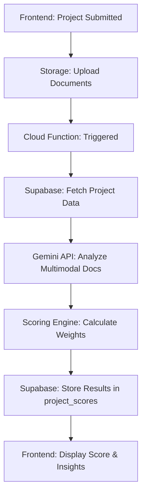

# Phase 4: AI Scoring Engine Implementation Plan

## Overview
Afri Connect requires an AI-driven vetting system to analyze project documents (Pitch Decks, Financial Models, Technical Specs) and generate standardized 'Capital Readiness' and 'Technical Readiness' scores.

## Architecture
- **Backend**: Google Cloud Function (Node.js)
  - Reasons: Native integration with Google Gemini, easy access to Firebase Storage where documents are stored.
- **AI Model**: Google Gemini 1.5 Flash (Multimodal)
  - Multimodal capabilities allow direct analysis of PDF/Image documents.
- **Database**: Supabase
  - Store scores in `project_scores` table.
- **Frontend**: Next.js
  - Trigger scoring after project submission.
  - Display score breakdown and AI recommendations.

## Scoring Logic (Weights)
1. **Documentation (20%)**: Completeness and quality of uploaded documents.
2. **Governance (20%)**: Clarity of board structure, voting rights, and legal framework.
3. **Financials (20%)**: Reliability of the financial model, debt/equity structure, and capital requirements.
4. **Risk (15%)**: Transparency in risk disclosures and mitigation strategies.
5. **Track Record (15%)**: Analysis of developer's history and team experience.
6. **AI Risk Assessment (10%)**: LLM's independent detection of red flags or inconsistencies.

## Implementation Steps

### 1. Backend: Google Cloud Function
- **Endpoint**: `POST /analyze-project`
- **Input**: `{ projectId: string }`
- **Process**:
  1. Initialize Gemini with project context and document URLs.
  2. Prompt Gemini to evaluate the project based on the defined weights.
  3. Parse the structured JSON response.
  4. Upsert into `project_scores` in Supabase.
- **Environment Variables**:
  - `GEMINI_API_KEY`
  - `SUPABASE_URL`
  - `SUPABASE_SERVICE_ROLE_KEY`

### 2. Frontend: Update Project Submission
- After the user submits the project and documents are uploaded, the frontend will call the Cloud Function.
- Show a "Vetting in progress" message with a progress indicator.
- Upon completion, redirect to the project detail page.

### 3. Frontend: Project Details
- Update `ProjectDetailsPage` ([`web/src/app/projects/[id]/page.tsx`](web/src/app/projects/[id]/page.tsx)) to display:
  - Detailed breakdown of the score (Governance, Financials, etc.).
  - Risk Flags (List of potential issues).
  - Recommendations (AI-generated advice for improving readiness).

## AI Prompt Strategy
The prompt will include:
- Role: "You are an institutional energy investment analyst."
- Context: Project details (MW size, location, technology, capital required).
- Input: Multimodal parts (PDFs of Pitch Deck, Financial Model summary, etc.).
- Instructions: Evaluate the project against the 6-point rubric.
- Output: Strictly formatted JSON matching the `project_scores` table schema.

## Mermaid Diagram

